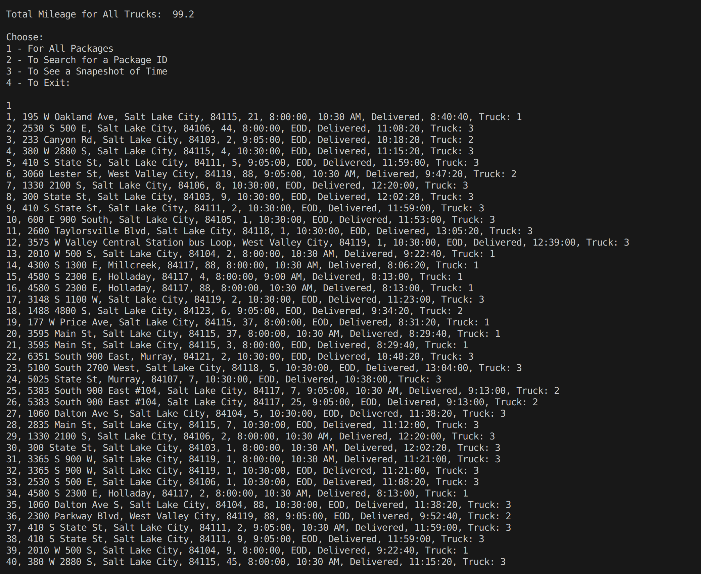

# SLC-WGUPS Traveling Salesman Problem

## Description

### Task: 
This is a project for WGU's bachelor's in computer science.  This is the classic traveling salesman problem.  In this task, there are 40 packages that must be delivered in Salt Lake City using three trucks, and two drivers. Each package has constraints as to when, where and how they should be delivered.  Each truck can carry a maximum of 16 packages, and the drivers must leave the hub no earlier than 8:00 am.  Package #9 requires an update to its delivery address at 10:20 am. The details of each package are given in packageFile.csv, and the distances between the destinations are given in distanceTable.csv.

### Solution:
- The nearest neighbor algorithm was used as a solution to this instance of the traveling salesman problem.
- A hash table was created from scratch to efficiently map the packages.
- Package, HashTable, and Truck classes were created to make the code organizable and reusable.
- A command line interface was created to output the delivery details.  The user can see the delivery details for all packages at the end of the day or at a certain time period.  The user can also search for a specific package based on package ID.

## Code and Resources Used
**Python Version:** 3.10.12   
**Packages:** datetime, csv
